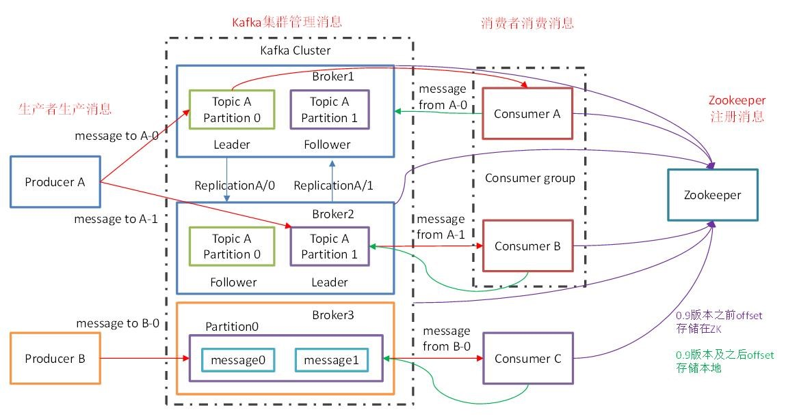
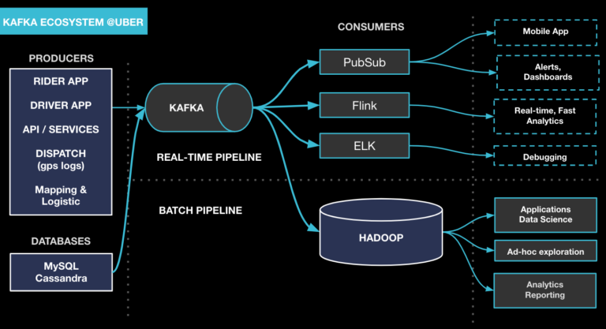
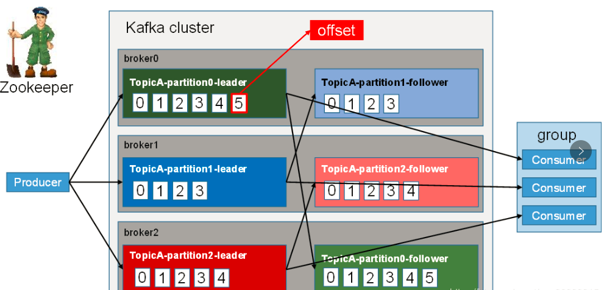
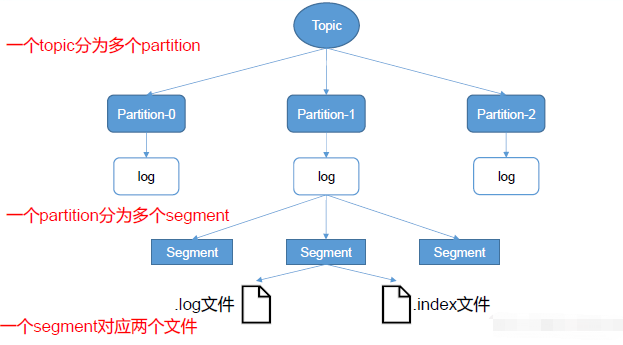
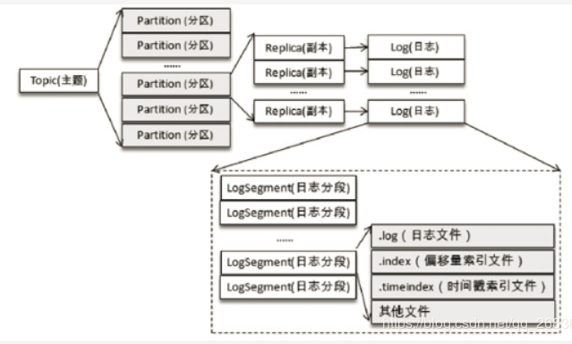
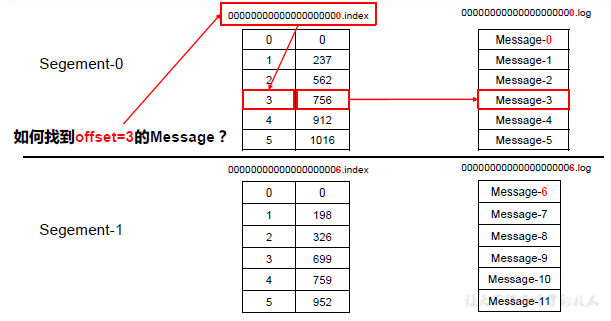
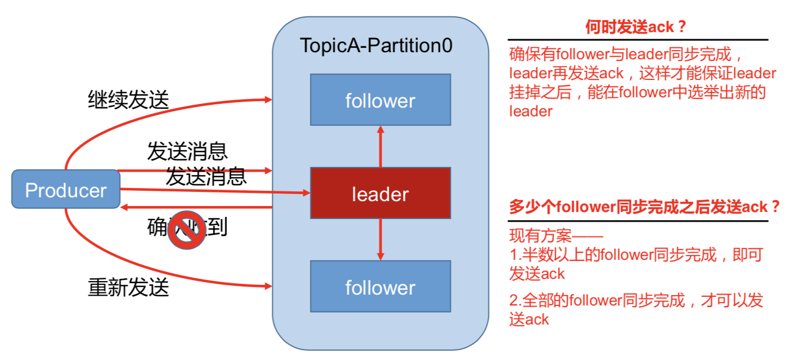
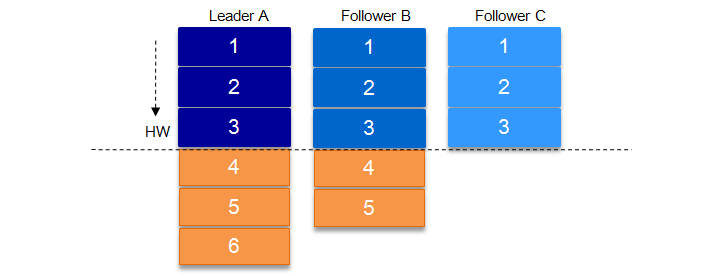
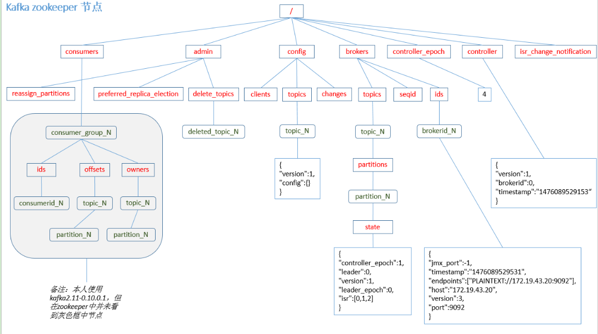
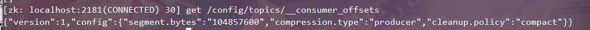

# Kafka 概述

## 定义

Kafka 是一个**分布式**的基于**发布/订阅模式**的消息队列，主要用于大数据实时处理领域

## 消息队列两种模式

1. 点对点模式

生产者生产消息发送到 Queue 中，然后消息消费者从 Queue中取出并消费。消息被消费后，Queue 中不再有存储，所以消息消费者不可能消费到已经被消费的消息。 Queue 支持存在多个消费者，但是对一个消息而言，只有一个消费者可以消费。

2. 发布/订阅模式

发布者将消息发布到 Topic 中，同时有多个消息订阅者消费该消息。和点对点模式不同，发布到 Topic 的消息会被所有订阅者消费。

## Kafka 基础架构





### 1. Producer

消息生产者，将消息 push 到 Kafka 集群中的 Broker。

### 2. Consumer

消息消费者，从 Kafka 集群中 pull 消息，消费消息。

### 3. Consumer Group

消费者组，由一到多个 Consumer 组成，每个 Consumer 都属于一个 Consumer Group。消费者组在逻辑上是一个订阅者。
消费者组内每个消费者负责消费不同分区的数据，一个分区只能由一个组内消费者消费；消费者组之间互不影响。
即每条消息只能被 Consumer Group 中的一个 Consumer 消费；但是可以被多个 Consumer Group 组消费。这样就实现了单播和多播。

### 4. Broker

一台 Kafka 服务器就是一个 Broker,一个集群由多个 Broker 组成，每个 Broker 可以容纳多个 Topic.

### 5. Topic

消息的类别或者主题，逻辑上可以理解为队列。Producer 只关注 push 消息到哪个 Topic, Consumer 只关注订阅了哪个 Topic。

### 6. Partition

负载均衡与扩展性考虑，一个 Topic 可以分为多个 Partition,物理存储在 Kafka 集群中的多个 Broker 上。可靠性上考虑，每个 Partition 都会有备份 Replica。

### 7. Replica

Partition 的副本，为了保证集群中的某个节点发生故障时，该节点上的 Partition 数据不会丢失，且 Kafka 仍能继续工作，所以 Kafka 提供了副本机制，一个 Topic 的每个 Partition 都有若干个副本，一个 Leader 和若干个 Follower。

### 8. Leader

Replica 的主角色，Producer 与 Consumer 只跟 Leader 交互。

### 9. Follower

Replica 的从角色，实时从 Leader 中同步数据，保持和 Leader 数据的同步。Leader 发生故障时，某个 Follower 会变成新的 Leader。

### 10. Controller

Kafka 集群中的其中一台服务器，用来进行 Leader election 以及各种 Failover（故障转移）。

### 11. ZooKeeper

Kafka通过Zookeeper存储集群的meta等信息。

# Kafka 快速入门

## 安装

必须先启动zookeeper，有点儿麻烦，所以我选择

**Docker真香！**

使用主目录文件`docker-compose.yml`然后 docker compose 直接安装即可！

## 命令行操作

```bash
# 在zookeeper创建一个分区为2，集群复制为1的test topic
kafka-topics.sh --create --zookeeper zookeeper:2181 --topic test --partitions 2 --replication-factor 1 
# 删除test topic
kafka-topics.sh --delete --zookeeper zookeeper:2181 --topic test 
# topic list
kafka-topics.sh --list --zookeeper zookeeper:2181
# 在topic上生产
kafka-console-producer.sh --bootstrap-server localhost:9092 --topic test
# 在topic上消费
kafka-console-consumer.sh --bootstrap-server localhost:9092 --topic test
```

# Kafka 架构深入

## 工程流程



Kafka 中的消息是以 Topic 进行分类的，生产者生产消息，消费者消费消息，都是面向 Topic 的。

Topic 是逻辑上的概念，而 Partition 是物理上的概念，每个 Partition 对应一个 log 文件，该 log 文件中存储的是 producer 生产的数据。producer 生产的数据会被不断追加到该 log 文件的末端，且每条数据都有自己的 offset。消费者组中的每个消费者，都会实时记录自己消费到了哪个 offset，以便出错恢复时，从上次的位置继续消费。

## 文件存储机制





由于生产者生产的消息会不断追加到 log 文件末端，为防止 log 文件过大导致数据定位效率低，kafka 采取了分片和索引机制，将每个 partition 分为多个 segment（逻辑上的概念，index + log 文件）

每个 partition（目录）相当于一个巨型文件被平均分配到多个大小相等的 segment（片段）数据文件中（每个 segment 文件中消息数量不一定相等），这种特性也方便 old segment 的删除，即方便已被消费的消息的清理，提高磁盘的利用率。每个 partition 只需要支持顺序读写就行，segment 的文件生命周期由服务端配置参数（log.segment.bytes，log.roll.{ms,hours}等若干参数）决定

每个 segment 对应两个文件 ----“.index” 和 “.log” 文件。分别表示为 segment 索引文件和数据文件（引入索引文件的目的就是便于利用二分查找快速定位 message 位置）。这两个文件的命名规则为：

partition全局的第一个 segment 从 0 开始，后续每个 segment 文件名以当前 segment 的第一条消息的 offset 命名，数值大小为 64 位，20 位数字字符长度，没有数字用 0 填充。

这些文件位于一个文件夹下（partition目录），改文件夹的命名规则：topic 名+分区序号。例如，first 这个 topic 有三个分区，则其对应的文件夹为first-0，first-1，first-2



og 文件和 index 文件都是以当前文件中的最小偏移量的值命名。index 文件存储大量的索引信息，log 文件存储大量的数据，**索引文件中的元数据对应数据文件中消息的物理偏移地址**。查找消息的时候，会根据 offset 值以二分查找的方式查找对应的索引文件，找到消息在 log 文件中的偏移量，最终找到消息。这也就能够保证，消费者挂掉重启的时候，可以根据 offset 值快速找到上次消费的断点位置。

## Kafka 生产者

### 分区策略

#### 分区的原因

1. **方便在集群中扩展**，每个 Partition 可以通过调整以适应它所在的机器，而一个 Topic 又可以由多个 Partition 组成，因此整个集群可以适应任意大小的数据
2. **提高并发**，因为可以以 Partition 为单位读写数据

#### 分区的原则

我们需要将 Producer 发送的数据封装成一个`ProducerRecord`对象

1. 指明 Partition 的情况下，直接将指明的值作为 Partition 的值
2. 没有指明 Partition 值但有 Key 的情况下，将 Key 的 hash 值与 Topic 的 Partition 数进行取余得到 Partition 值
3. 既没有 Partition 的值又没有 Key 值的情况下，第一次调用时随机生成一个整数，将这个值与 Topic 可用的 Partition 总数取余得到 Partition，也就是 round-robin 算法

### 数据可靠性保证

为保证 producer 发送的数据，能可靠的发送到指定的 topic，topic 的每个 partition 收到 producer 发送的数据后，都需要向 producer 发送 ask，如果producer 收到 ask，就会进行下一轮的发送，否则重新发送数据



#### 副本同步策略

|             方案             |                             优点                             |                             缺点                             |
| :--------------------------: | :----------------------------------------------------------: | :----------------------------------------------------------: |
| 半数以上完成同步，就发送 ack |                            延迟低                            | 选择新的 leader 时，容忍 n 台结点的故障，<br />需要 2n+1 个副本 |
|   全部完成同步后，发送 ack   | 选举新的 leader 时，容忍 n 台结点的故障<br />只需要 n+1 个副本 |                            延迟高                            |

Kafka 选择了第二种方案，原因：

1. 同样为了容忍 n 台节点的故障，第一种方案需要 2n+1 个副本，而第二种方案只需要 n+1 个副本，而 Kafka 的每个分区都有大量的数据，第一种方案会造成大量数据的冗余
2. 虽然第二种方案的网络延迟比较高，但网络延迟对 Kafka 影响较小

#### ISR

采用第二种方案后，设想以下情景：

leader 收到数据，所有 follower 都开始同步数据，但有一个 follower，因为某种故障迟迟不能与 leader 进行同步，那么 leader 就要一直等一去，直到它完成同步才能发送ask，这种问题如何解决？

leader 维护了一个动态的 in-sync replica set（ISR），意味和 leader 保持同步的 follower 集合。当 ISR 中的 follower 完成数据的同步之后，leader 就会给 follower 发送 ask。如果 follower 长时间未向 leader 同步数据，则该 follower 将被踢出 ISR，该事件阈值由 replica.lag.time.max.ms 参数设定。leader 发生故障之后，就会从 ISR 中选举新的 leader

#### ack 应答机制

对于某些不太重要的数据，对数据的可靠性要求不是很高，能够容忍数据的少量丢失，所以没必要等 ISR 中的 follower 全部接受成功

所以 Kafka 为用户提供了三种可靠性级别，用户根据对可靠性和延迟的要求进行权衡。

**acks 参数配置：**

0：producer 不等待 broker 的 ack，这一操作提供了一个最低的延迟，broker 一接收到数据还没有写入磁盘就已经返回，当 broker故障时有可能**丢失数据**

1：producer 等待 broker 的 ack，partition 的 leader 落盘成功后返回 ack，如果在 follower 同步成功之前 leader 故障，那么将会**丢失数据**

-1：producer 等待 broker 的 ack，partition 的 leader 和 follower 全部落盘成功后才返回 ack。但是如果 follower 同步成功后，broker 发送 ack 之前，leader发生故障，那么将会造成**数据重复**

### 数据一致性问题

这里的数据一致性主要是说不论是老的 Leader 还是新选举的 Leader，Consumer 都能读到一样的数据。那么 Kafka 是如何实现的呢？



首先先介绍 **HW(HighWatermark)高水位**，取一个 partition 对应的 ISR 中最小的 LEO 作为 HW，consumer 最多只能消费到 HW 所在的位置。另外每个 replica 都有 HW,leader 和 followe r各自负责更新自己的 HW 的状态。对于 leader 新写入的消息，consumer 不能立刻消费，leader 会等待该消息被所有 ISR中 的 replicas 同步后更新 HW，此时消息才能被 consumer 消费。这样就保证了如果 leader 所在的 broker 失效，该消息仍然可以从新选举的 leader 中获取。对于来自内部 broker 的读取请求，没有 HW 的限制

如上图，某个topic的某partition有三个副本，分别为 A、B、C。A 作为leader肯定是 LEO 最高，B 紧随其后，C 机器由于配置比较低，网络比较差，故而同步最慢。这个时候 A 机器宕机，这时候如果 B 成为 leader，假如没有 HW，在 A 重新恢复之后会做同步 (makeFollower) 操作，在宕机时log 文件之后直接做追加操作，而假如 B 的 LEO 已经达到了 A 的 LEO，会产生数据不一致的情况，所以使用 HW 来避免这种情况。
A 在做同步操作的时候，先将 log 文件截断到之前自己的 HW 的位置，即 3，之后再从 B 中拉取消息进行同步。

这样做的原因是还没有被足够多副本复制的消息被认为是“不安全”的，如果 Leader 发生崩溃，另一个副本成为新 Leader，那么这些消息很可能丢失了。如果我们允许消费者读取这些消息，可能就会破坏一致性。试想，一个消费者从当前 Leader（副本0） 读取并处理了 4，这个时候 Leader 挂掉了，选举了副本 1 为新的 Leader，这时候另一个消费者再去从新的 Leader 读取消息，发现这个消息其实并不存在，这就导致了数据不一致性问题。

如果失败的 follower 恢复过来，它首先将自己的 log 文件截断到上次 checkpointed 时刻的 HW 的位置，之后再从 leader 中同步消息。leader 挂掉会重新选举，新的 leader 会发送“指令”让其余的 follower 截断至自身的 HW 的位置然后再拉取新的消息。

当 ISR 中的个副本的LEO不一致时，如果此时leader挂掉，选举新的leader时并不是按照LEO的高低进行选举，而是按照ISR中的顺序选举。

## Kafka 消费者

### 消费方式

consumer 采用 pull 模式从 broker 中读取数据

push 模式很难适应消费速率不同的消费者，因为消息发送速率是由 broker 决定的。它的目标是尽可能以最快速度传递消息，但是这样很容易造成 consumer 来不及处理消息，典型的表现就是拒绝服务以及网络拥塞。而 pull 模式则可以根据 consumer 的消费能力以适当的速率消费消息。

pull 模式不足之处是，如果 kafka 没有数据，消费者可能会陷入循环中，一直返回空数据。针对这一点，kafka 的消费者在消费数据时传入一个时长参数 timeout，如果当前没有数据可供消费，consumer 会等待一段时间之后返回，这段时长即为timeout。

### 分区分配策略

一个 consumer group 中有多个consumer，一个 topic 有多个 partition，所以必然会涉及到 partition 的分配问题，即确定哪个 partition 由哪个 consumer 来消费

Kafka 有三种分配策略，一个是 RoundRobin（轮询），一个是 Range（随机），还有一个是 Stick

#### Range（默认）

Range 策略情况下，该策略是对于一个 Topic 而言的一个策略。

首先对同一个 Topic 里面的分区按照序号进行排序，并对消费者按照字母进行排序。然后用 Partitions 分区的个数除以消费者的消费者线程总数来决定每个消费者消费几个分区，如果除不尽，则前面的几个消费者线程会多消费一个分区。

#### RoundRobin

> 前提：同一个 Consumer Group，每个消费者订阅的主题必须相等

在 RoundRobin 策略下，分区的数据是以轮询的方式进行分配分配到消费者

#### Stick

Sticky 分配策略，这种分配策略是在kafka的 0.11.X 版本才开始引入的，是目前最复杂也是最优秀的分配策略

Sticky 分配策略的原理比较复杂，它的设计主要实现了两个目的：

1. 分区的分配要尽可能的均匀
2. 分区的分配尽可能的与上次分配的保持相同

根据者这两个目的，首先该策略采用 RoundRobin 的方式进行轮询的分配分配给消费者消费，如过在某一个过程中消费者挂了，那么这个消费者消费的分区就会被拿出来再根据 RoundRobin 策略分配给健康的消费者，已到达尽可能均匀并且不进行重新分配所有分区以此实现分区的分配尽可能的与上次分配的保持相同

### offset 维护

由于 consumer 在消费过程中可能会出现断电宕机等故障，consumer 恢复后，需要从故障前的位置继续消费，所以 consumer 需要实时记录自己消费到了哪个 offset，以便故障恢复后继续消费



Kafka0.9 版本之前，consumer 默认将 offset 保存在 Zookeeper 中，从 0.9 版本开始，consumer 默认将 offset 保存在 Kafka 一个内置的 topic 中，该 topic 为 `__consumer_offsets`



## Kafka 高效读写数据

### 1. 顺序写磁盘

Kafka 的 producer 生产数据，要写入到 log 文件中，写的过程是一直追加到文件末端，为顺序写。

官网有数据表明，同样的磁盘，顺序写能到 600M/s，而随机写只有 100K/s。这与磁盘的机械架构有关，顺序写之所以快，是因为其省去了大量磁盘寻址的时间。

### 2. 零拷贝 sendfile(in,out)

数据直接在内核完成输入和输出，不需要拷贝到用户空间再写出去。

kafka数据写入磁盘前，数据先写到进程的内存空间。

### 3. mmap文件映射

在进程的非堆内存开辟一块内存空间，和 OS 内核空间的一块内存进行映射，

kafka 数据写入、是写入这块内存空间，但实际这块内存和 OS 内核内存有映射，也就是相当于写在内核内存空间了，且这块内核空间、内核直接能够访问到，直接落入磁盘。

这里，我们需要清楚的是：内核缓冲区的数据，flush 就能完成落盘。

## Zookeeper 在 Kafka 中的作用

Kafka 集群中有一个 broker 会选举为 Controller，负责管理集群 broker 的**上下线**，所有 topic 的**分区副本分配**和**leader选举**等工作

Controller 的管理工作都是依赖于 Zookeeper 的
